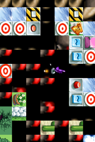
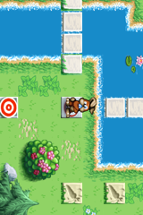
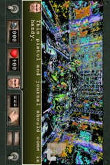
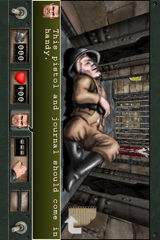
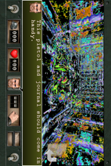
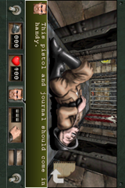
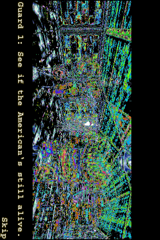
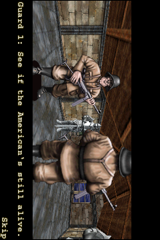

# LightTouchMac #12 and #15 on the emulator, before and after the fixes

Both issues are GL-bridge bugs fixed on `ipad1`:

- **#12, Bobby Carrot Forever** — `c0c86726a0`: the drawable's colour texture, depth
  renderbuffer and FBO now take host-private names from `0x40000000`, so the game's first
  `glGenTextures` returns 1 again. Bobby binds textures by load order from 1.
- **#15, Wolfenstein RPG** — `953fec2ee0`: 16-bit paletted-texture entries
  (`GL_PALETTE*_RGB5_A1_OES` and friends) are little-endian.

Both were verified by playing the games on 2026-09-29.

## How it was run

- **Emulator.** "tip" is `ipad1` at `e72fab4f9e`. "before" is the same commit with
  `953fec2ee0` and `c0c86726a0` reverted. There is one hand-resolved conflict: the tip's
  `GL_DEPTH24_STENCIL8` depth buffer stays, and the later sync/copy FBOs go back to
  `glGenFramebuffersEXT`. So the two builds differ only in the fixes.
  - The literal parent, `ad284b0176`, is 204 commits behind the tip. Its GL host predates the
    runtime dispatch layout that the tip's guest engines use, so a device prepared for the
    tip cannot run on it.
  - Both builds use `scripts/configure-patched-ffmpeg`.
- **Devices.** Made with the app's `firmwarekit create` (LightTouchMac `multidevice`
  `e7362b4`), using guest tools from `contrib/export-guest-artifacts.sh` at the tip:
  - iPod touch 2G **7E18** (3.1.3) and **8C148** (4.2.1). The 8C148 device uses the
    keybag one-shot through `LightTouchDevice`.
  - Each run boots a fresh overlay of the same prepared device, with the machine options the
    app boots with: `h264-decode=on,scaler-decode=on,mpvd-decode=on,amc-mode=decode,lcd-planes=on`.
    Without `amc-mode=decode`, Bobby's tutorial movie stalls on a spinner, which is unrelated
    to these issues.
- **Harness.** `tests/ipod/regress.py --checks boot,appinstall,applaunch --launch-stages` did
  the install and launch. A small wrapper then held the app open and drove it over QMP:
  touch taps and swipes, `screendump`, and the machine's `gles-rejects` property.
- **iPad.** Not run. Neither game is universal: Bobby's `UIDeviceFamily` is `[1]`, and
  Wolfenstein has no family key (iPhone only).

| IPA (`~/Downloads/ios3/`) | Bundle | MinimumOS | SHA-256 |
| --- | --- | --- | --- |
| `BobbyCarrotForever-1.50-legacystore42943.ipa` | `com.FDGMobileGamesGbR.BobbyCarrot` 1.50 | 3.1.3 | `2f4d99efce2c01976bc732ab2f3c0424e3c2d6ab430e772c8cf89aa98f082bd5` |
| `WolfensteinRPG-1.1.0-legacystore26814.ipa` (Legacy Store app 315286978, its only version) | `com.eamobile.wolfinc` 1.1.0 | 2.2.1 | `c6a969361e0b4bf01a49a9789a80fe5e62b95f8bb47ce273b4d90f1832dcff52` |

## #12 Bobby Carrot Forever: reproduced before, fixed on the tip (7E18 and 8C148)

The "before" builds show the issue's symptom on every GL screen: sprites break into tiles
that are displaced and cross-textured. This happens on the first-launch Options menu, the
title screen, the main menu and in the level. The tip renders all of them correctly.

| Screen | before | tip |
| --- | --- | --- |
| Options, 7E18 |  |  |
| Main menu, 7E18 |  |  |
| Options, 8C148 |  |  |
| Main menu, 8C148 |  |  |
| First level, 8C148 |  |  |

- **GL log.** "before" renders the drawable's own colour texture as `bound_tex=1`, which is the
  game's first texture name. The tip renders it as `bound_tex=1073741824` (`0x40000000`).
  See `screens/issues/gl-logs/bc-*`.
- **`gles-rejects`.** `{}` on all four runs. Nothing was refused: the glitch was a name
  collision, not an unimplemented call.
- **In-level pause menu.** Not reached. Taps, long press (which zooms the map) and swipes
  (which move Bobby) did not open it. The Options menu above is the game's own Options screen.

## #15 Wolfenstein RPG: reproduced before, fixed on the tip (7E18 and 8C148)

The "before" builds match the report ("fuzzy and purple"). Every paletted texture decodes
as noise, both in the engine-rendered cutscene and in the level. The tip renders walls,
the doorway and the dead guard (the enemy) correctly.

| Screen | before | tip |
| --- | --- | --- |
| In level (first room, the guard), 7E18 |  |  |
| In level (first room, the guard), 8C148 |  |  |
| Cutscene, two guards ("See if the American's still alive") |  (8C148) |  (7E18) |

- **GL log.** The same `0x8b99` (`GL_PALETTE8_RGB5_A1_OES`) uploads decode to different
  pixels. Before, alpha is noise: `512x512 -> mean rgba 139,132,108,133` and
  `128x128 -> 126,142,142,159`. On the tip they are opaque: `44,56,123,255` and
  `58,59,58,255`. See `screens/issues/gl-logs/wolf-*`.
- **`gles-rejects`.** `{}` on all four runs.

## Gates

- **`tests/ipod/test_gles_palette.py`.** Passes on the tip. The same test run against the
  reverted source fails its first assertion, as it should.
- **`tests/ipod/regress.py --checks boot,gles`** on both devices and both builds:

| device | build | boot | gles (GLTest fixture: magenta / cyan / yellow) |
| --- | --- | --- | --- |
| 7E18 | tip | PASS | PASS 0.141 / 0.281 / 0.141 |
| 7E18 | before | PASS | PASS 0.141 / 0.281 / 0.141 |
| 8C148 | tip | PASS | PASS 0.141 / 0.281 / 0.141 |
| 8C148 | before | PASS | PASS 0.141 / 0.281 / 0.141 |

The fixes do not change the regress GL leg: every run reports "shim log reached the host, no unimplemented slot".

- **`tests/ipod/test_gles_drawable_storage.py`** (the #12 unit test) does not compile on the
  tip, independent of these fixes. It has no stub for `gles_guest_fault_pending`, which
  `gles-host.c` now calls. The test is stale; the fix it covers is what the runs above exercise.
